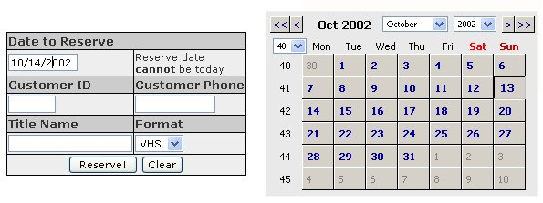



## Online Video Rental Reservation

### Description

For reserving video rentals online at your Video Store's website. Allows searching of reservations by date. Has web-browser front-end for viewing reservations, deleting, and also customer entry and deletion. Uses ADO for database storage.

Thanks to Christian Reisch for his code I used for the ASP based calender routine.
 
### More Info
 

             |
---                |---
**Submitted On**   |2002-10-14 18:47:28
**By**             |[IanCT](https://github.com/Planet-Source-Code/PSCIndex/blob/master/ByAuthor/ianct.md)
**Level**          |Intermediate
**User Rating**    |5.0 (10 globes from 2 users)
**Compatibility**  |ASP \(Active Server Pages\) 
**Category**       |[Internet/ HTML](https://github.com/Planet-Source-Code/PSCIndex/blob/master/ByCategory/internet-html__1-34.md)
**World**          |[Visual Basic](https://github.com/Planet-Source-Code/PSCIndex/blob/master/ByWorld/visual-basic.md)
**Archive File**   |[Online\_Vid14621210142002\.zip](https://github.com/Planet-Source-Code/ianct-online-video-rental-reservation__1-39839/archive/master.zip)

